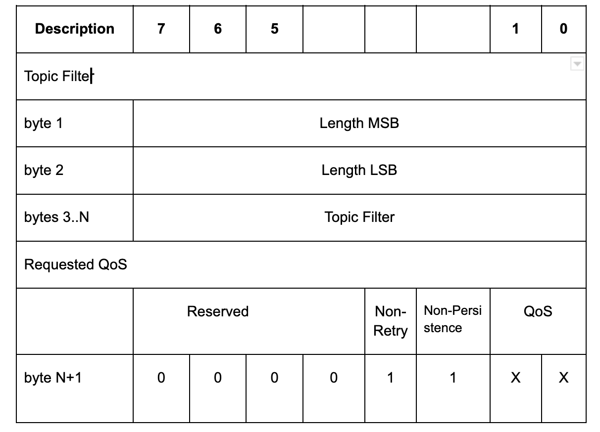

# Custom options over QoS 1 in MQTT v3.1.1

We have added to options to the subscribe packet:
- Non-Retry
- Non-Persistence

These options can be used in QoS 1 topics to modify the behaviour of QoS 1 messages published to these clients. 

## Non-Retry
This option disables the functionality in the broker to retry QoS 1 messages. A perfect use-case of such behaviour is when you want to track reliability of message delivery (tracked using PubAcks) but do not want to retry the message to avoid staleness or duplication among other reasons.

## Non-Persistence
This option disables persistence of messages. This is useful again to avoid stale messages to clients. 
Both the options combined can give you QoS 0 behaviour with PubAck which we find suitable for some of our use-cases.

## Subscribe packet
The payload of a SUBSCRIBE Packet contains a list of Topic Filters indicating the Topics to which the Client wants to subscribe.
Each filter is followed by a byte called the Requested QoS. This gives the maximum QoS level at which the Server can send Application Messages to the Client. We have modified this byte to add information about non-retry and non-persistence.

The requested maximum QoS field is encoded in the byte following each UTF-8 encoded topic name, and these Topic Filter / QoS and non-retry and non-persistence bits are packed contiguously.

